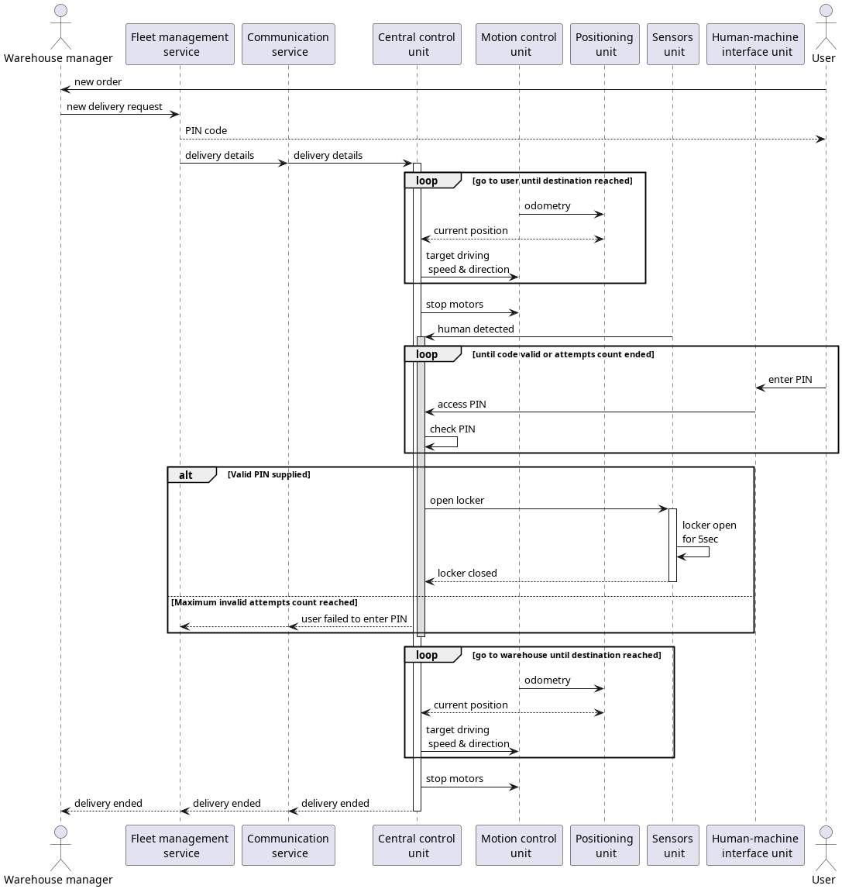

# Отчёт о выполнении задачи "Робот-доставщик"

- [Отчёт о выполнении задачи "Робот-доставщик"](#отчёт-о-выполнении-задачи-робот-доставщик)
  - [Постановка задачи](#постановка-задачи)
  - [Известные ограничения и вводные](#известные-ограничения-и-вводные)
    - [Цели и Предположения Безопасности (ЦПБ)](#цели-и-предположения-безопасности-цпб)
      - [Цели](#цели)
      - [Предположения](#предположения)
  - [Архитектура решения](#архитектура-решения)
    - [Компоненты](#компоненты)
      - [Монитор безопасности](#монитор-безопасности-security-monitor)
    - [Алгоритм работы решения](#алгоритм-работы-решения)
    - [Описание сценариев), при которых ЦБ нарушаются](#описание-сценариев-при-которых-цб-нарушаются)
      - [Негативный сценарий 1. ](#негативный-сценарий-1-менеджер-не-проверяет-обновление)
      - [Сводная таблица негативных сценариев](#сводная-таблица-негативных-сценариев)
    - [Указание "доверенных компонент" на архитектурной диаграмме с обоснованием выбора](#указание-доверенных-компонент-на-архитектурной-диаграмме-с-обоснованием-выбора)
    - [Политики безопасности](#политики-безопасности)
  - [Запуск приложения и тестов](#запуск-приложения-и-тестов)
    - [Запуск приложения](#запуск-приложения)
    - [Запуск тестов](#запуск-тестов)

---
## Постановка задачи

Задача заключается в построении безопасной системы управления парком автоматизированных роботов-доставщиков, 
для доставки заказов из интернет-магазина на дом клиенту с возможностью подтверждения личности клиента.

Реализовать прототип вышеописанного решения, в рамках которого
* "робот" получает задание на доставку с параметрами доставки (координаты, PIN)
* имитация сервиса доставки выдаёт информацию "приехал/не приехал" в консоль (механизм автоматического уведомления пользователя о прибытии робота не требуется)
* робот рассчитывает движение, осуществляет его с учётом ограничений и прибывает в место назначения
* также после состояния "приехал" через HMI пользователь может ввести PIN код для получения доступа к хранилищу
* если робот прибыл в место назначения и получил правильный PIN код, срабатывает имитация открытия хранилища (информация отображается в консольном окне)
* после "выдачи заказа" робот должен вернуться на склад и передать статус "доставлено" серверу
* в случае ошибки робот, не открывая хранилище, должен вернуться на склад и передать серверу статус "ошибка"

## Известные ограничения и вводные

1. По условиям организаторов должна использоваться микросервисная архитектура и шина обмена сообщениями для реализации асинхронной работы сервисов.
2. Разработка интернет магазина не требуется, процесс начинается с выдачи системе заказа менеджером склада
3. Разработка графических интерфейсов не требуется, вместо этого допустимо применение любых существующих решений для отправки REST запросов 
4. Для товаров принята модель без размера и веса, возможно заказать любой набор товаров
5. Робот должен иметь возможность функционировать автономно (без соединения с сетью) с момента получения роботом заказа и до возврата на склад
6. В рамках MVP не используются глобальные системы позиционирования, источник данных местоположения - одометрия

### Цели и Предположения Безопасности (ЦПБ)

#### Цели

1. обеспечение сохранности груза до момента передачи авторизованному клиенту
2. (*) обеспечение достижения роботом исходно заданного местоположения 
3. получение задания только от корпоративного сервера
4. невозможность доступа к грузу вне местоположения клиента
5. возврат груза на склад в случае многократных попыток неавторизованного доступа
6. обеспечить безопасность окружающей среды от действий робота

> (*) - данная цель может не учитываться в зависимости от различных обстоятельств, так как она есть следствие 
> правильного выполнения бизнес-функций системы, подробнее рассмотрено в разделе "Препятствование выполнению бизнес-функции без нарушения ЦБ"

#### Предположения

1. не рассматриваются атаки, связанные с использованием физического доступа к роботу
2. в рамках задания не рассматривается процесс доставки PIN кода пользователю
3. робот должен иметь возможность функционировать автономно с момента получения задания до возврата на склад
4. задание считается выполненным по возвращении робота на склад
5. монитор безопасности считается доверенным
6. шина сообщений считается доверенной
7. система контейнеризации считается доверенной
8. не рассматриваются вектора атак на ОС и системные приложения
9. злоумышленник не обладает техническими средствами, позволяющими взломать современные криптосистемы
10. инциденты журналируются, возможно отследить как попытки несанкционированного доступа кк грузу, так и весь внутренний обмен сообщениями

## Архитектура решения

### Компоненты

#### Оригинальный вариант 

| Название                         | Назначение                                                                                        | Комментарий                                                                                                      |
|----------------------------------|---------------------------------------------------------------------------------------------------|------------------------------------------------------------------------------------------------------------------|
| *Fleet management service* (FMS) | распределяет пользовательские заказы по роботам и обрабатывает статусы заказов                    | основной сервис в серверной части                                                                                |
| *Communication service* (CS)     | осуществляет взаимодействие робота c сервисом управления парком роботов                           | REST взаимодействие с *FMS*                                                                                      |
| *Central control unit* (CCU)     | основная логика функционирования робота                                                           | взаимодействие со всеми сервисами робота через *MB*                                                              |
| *Positioning* (PU)               | определяет местоположение робота                                                                  | имитирует одометрию на основе данных *motion control*                                                            |
| *Motion control* (MCU)           | осуществляет управление механической частью робота                                                | основная задача - проверка ограничений на параметры движения                                                     |
| *Sensors* (SU)                   | получает информацию из внешней среды о препятствиях и управляет замком                            | всегда "видит" человека по прибытии на точку заказа                                                              |
| *HMI* (HMI)                      | осуществляет взаимодействие клиента с роботом                                                     | нет GUI/TUI, только REST запросы                                                                                 |
| *Security monitor* (SM)          | авторизует операцию, если она удовлетворяет заданным правилам или блокирует её в противном случае |                                                                                                                  |
| *Message bus* (MB)               | шина сообщений и брокер - сервис передачи сообщений от источника получателям                      | Kafka + Zookeeper                                                                                                |

#### Доработанный вариант 

| Название                            | Назначение                                                                                        | Комментарий                                                                                                      |
|-------------------------------------|---------------------------------------------------------------------------------------------------|------------------------------------------------------------------------------------------------------------------|
| *Fleet management service* (FMS)    | распределяет пользовательские заказы по роботам и обрабатывает статусы заказов                    | основной сервис в серверной части                                                                                |
| *Authentication service* (AS)       | обеспечивает создание, шифрование и распространение пользователям и FMS PIN-кодов                 | **новый сервис** *(см. описание негативных сценариев)* - обеспечивает сохранность PIN кода при компрометации FMS |
| *Communication service* (CS)        | осуществляет взаимодействие робота c сервисом управления парком роботов                           | REST взаимодействие с *FMS*                                                                                      |
| *Central control unit* (CCU)        | основная логика функционирования робота                                                           | взаимодействие со всеми сервисами робота через *MB*                                                              |
| *Positioning unit* (PU)             | определяет местоположение робота на основе данных нескольких драйверов местоположения             |                                                                                                                  |
| *Odometer Positioning Driver* (OPD) | определяет местоположение робота по одометрии от MCU                                              | имитирует одометрию на основе данных *motion control*                                                            |
| *Global Positioning Driver* (GPD)   | определяет местоположение робота по GPS                                                           | заглушка аналогичная OPD, чтобы было интересно сравнивать их в PU                                                |
| *Motion control unit* (MCU)         | осуществляет управление механической частью робота                                                | основная задача - проверка ограничений на параметры движения                                                     |
| *Sensors* (SU)                      | получает информацию из внешней среды о препятствиях и управляет замком                            | всегда "видит" человека по прибытии на точку заказа                                                              |
| *HMI* (HMI)                         | осуществляет взаимодействие клиента с роботом                                                     | нет GUI/TUI, только REST запросы                                                                                 |
| *Security monitor* (SM)             | авторизует операцию, если она удовлетворяет заданным правилам или блокирует её в противном случае |                                                                                                                  |
| *Message bus* (MB)                  | шина сообщений и брокер - сервис передачи сообщений от источника получателям                      | Kafka + Zookeeper                                                                                                |

> Сокращения данные в таблице далее будут активно использоваться

#### Описание изменений архитектуры

1. Введен новый модуль (доверенный) - Authentication service, который по запросу от FMS через MB 
выполняет генерацию PIN-кода для нового заказа, отправляет его пользователю, затем шифрует и возвращает в FMS,
таким образом обеспечивая его сохранность до достижения CCU, обладающего ключем для расшифрования.

2. Для обеспечения сохранности адреса, теперь FMS принимает его только совместно с цифровой подписью интернет-магазина,
сертификат для валидации также заранее размещен в CCU.

3. Взаимодействие FMS и роботов осуществляется через доверенный корпоративный VPN на основе Wireguard.

4. Модуль Positioning unit разбит на несколько недоверенных драйверов (Positioning Driver) для различных источников местоположения и 
доверенный агрегатор Positioning unit

Причины внесенных изменений расписаны в негативных сценариях.
  


#### Монитор безопасности


### Алгоритм работы решения

> Во всех sequence diagram опущен MB и SM, подразумевается что взаимодействия на схеме обрабатываются этой связкой всегда



### Описание сценариев, при которых ЦБ нарушаются

> Далее ЦБ - Цель Безопасности, ПБ - Предположение Безопасности.

На основе сценариев возможных атак рассмотрим изменения, которые необходимо внести в архитектуру и реализацию для обеспечения выполнения ЦБ

По ПБ№5,6 считаем доверенной систему передачи сообщений между сервисами, поэтому вектора атак на нее, а также на 
монитор безопасности мы опускаем.

Отметим, что для всех сервисов данного решения есть общий сценарий, далее при рассмотрении атак на отдельные компоненты он будет опускаться.  
В случае, если компонент был скомпрометирован, атакующий имеет возможность обеспечить такое (не)функционирование сервиса,
что будет осуществлено прекращение выполнения бизнес-функции. Более того далее некоторые решения, 
позволяющие избежать нарушения ЦБ будут на самом деле заменяют поведение системы
с нарушающего ЦБ на невыполняющее бизнес-функцию. То есть, если атака данного вида будет организована так, 
что ее действие будет постоянным (например код FMS изменен так, что он всегда перед отправкой меняет пакеты так, что они становятся невалидными и далее роботом всегда отвергаются), 
то это можно будет считать неким видом DOS-атаки на систему, так как робот с момента начала атаки перестанет иметь возможность достичь места назначения
(либо не получит задание вообще, либо во время его выполнения не будет двигаться/выполнять иные функции).

В ЦБ был внесен пункт №2 _(обеспечение достижения роботом исходно заданного местоположения)_, он был выведен из требований к бизнес-процессу,
соответственно при его нарушении, бизнес-функция доставки тоже считается невыполненной. 

Можно подходить с различных точек зрения ко включению или исключению данного пункта в ЦБ. 
Технически для разработчика системы и оператора системы этот вопрос сводится к тому, что будет дешевле: 
разработка и поддержка сильно большего числа доверенных сервисов (в крайнем случае это даже может привести к тому, что все сервисы станут доверенными, что плохо),
или возможность одномоментно получить полностью заблокированную систему, но без нарушения ЦБ. 

По моему мнению, лучше выбрать подход с включением ее в ЦБ, но при этом реализовать безопасность придется следующим образом:
большие сервисы, имеющие множество функций и интерфейсов с внешней средой, соответственно вектора и вектора все атак учти уже будет сложнее, 
значит они имеют бОльшую вероятность быть пораженными, их придется назначить доверенными. 
Маленькие сервисы (MCU, PU, HMI) лучше максимально изолировать доверенными средствами (например контейнеризации ПБ№7),
они выполняют в основном одну функцию каждый, значит требуется меньшее число зависимостей, 
в некоторых случаях даже лучше избавиться от высокоуровневых библиотек и фреймворков в пользу прямого использования системных возможностей. 
Везде, где необходим доступ в сеть, следует ограничить допустимые запросы при помощи iptables.
Рассмотрение атак на ОС в рамках задачи бессмысленно, так как в случае, например, если это позволит выполнять некоторый произвольный код, 
пользовательские приложения не смогут это обнаружить, поэтому всегда применяем классические средства защиты, нацеленные на ОС.
В большинстве случаев это применимо, так что будет опущено в отдельных кейсах.


#### Негативный сценарий 1. (FMS выдает неверные задания)

Процесс начинается с получения FMS данных о заказе от менеджера склада. 
Данный модуль является единой точкой отказа для все системы, так как он обеспечивает диспетчеризацию заказов для всех роботов.
Отметим, что необходимо обеспечить физическую безопасность ЦОД, в котором размещен сервер с данным модулем.
Возможна и DDOS-атака на FMS, защита от такого сценария классическая, рассмотрена не будет.

При его компрометации возможно выдавать роботам задания не соответствующие пользовательским с заранее известными кодами доступа,  
что позволяет атакующему получить доступ к материальным ценностям доставляемым роботами, так как возможность проверки роботом содержания задания невозможна.

Нежелательно назначать FMS доверенным компонентом, так как данная система вероятнее всего сложна исходя из выполняемой бизнес-функции.
Значит FMS должен иметь возможность работы с заказом так (считаем что для диспетчеризации адрес точно нужен, иначе FMS не сможет в условиях реального города, как вариант расширения системы, выбрать склад наиболее близкий к пользователю), 
что внесенные в него изменения во время работы могли быть обнаружены до начала его выполнения.
Это реализуется посредствам добавления цифровой подписи в сообщение с адресом доставки на этапе до его отправки в FMS (в интернет магазине),
при этом криптографические ключи должны быть заранее установлены в робота. 
Тогда любая доверенная компонента в роботе может проверить, что доставка будет осуществлена в требуемое место.

Если злоумышленник имеет и адрес и код, он сможет изъять груз. Достаточно не дать доступа к одному из этих полей. 
Адрес мы должны обрабатывать в FMS, его шифровать нельзя, а вот PIN код нужен только на роботе, значит остается только зашифровать его перед передачей в FMS.
Введем в систему новый сервис - сервис аутентификации (authentication service - AS), по изначальному заданию он тоже существует, но находится вне рассмотрения, так как реализует доставку PIN кода пользователю (ПБ №2).
Назначим ему создание PIN кода и отправку его пользователю. Тогда при передаче кода в FMS он будет его шифровать, а доверенный сервис на роботе - расшифровывать, аналогично с подписью адреса, заранее на роботе разместим криптографический ключ.
Также см. раздел указание доверенных компонент.

Придется назначить AS доверенным, так как иначе смысл шифрования PIN-кодов теряется, ибо будет легко извлечь исходные ключи, и использовать их как для расшифровки PIN, так и для создания подставных PIN.
Также считаем, что злоумышленник не обладает достаточными вычислительными мощностями для взлома современных алгоритмов шифрования.

Если FMS умышленно делает отправляемые пакеты невалидными, получаем нарушение ЦБ№2, так как все заказы проходят через него и все они будут отвергнуты роботом.
От этого нельзя защититься напрямую, и как уже было сказано во введении этой секции, придется либо 
организовывать максимальную безопасность внешне, либо назначать его доверенным, но в таком случае и CS по аналогичной причине станет доверенным.

Вне рамок ПБ№2 (соответственно рассмотрено не будет) существует угроза перехвата PIN кода 
во время доставки его пользователю (MITM) или же посредством компрометации ПО пользовательского устройства. 
В таком случае возможно получить заказ вместо пользователя, причем защиты от этого на стороне робота не может быть 
кроме как через введение дополнительных вариантов авторизации (Bluetooth соединение со смартфоном, распознавание лиц)

Нарушение ЦБ№1. Решение изложено выше и реализовано.


#### Негативный сценарий 2. (CCU получает измененное злоумышленником задание)
Взаимодействие робота и FMS происходит при помощи REST HTTP запросов. 
Следовательно, возможна MITM-атака при взаимодействии FMS и CS. 

Злоумышленник получает возможность получить/изменить адрес доставки, получить/изменить PIN-код, 
что приводит к возможности изъятия им груза. 
Данная уязвимость была частично закрыта в сценарии 1 (см. "FMS выдает неверные задания") через введение цифровой подписи адреса и шифрования кода.
То есть можно только прочитать адрес (но не изменить), и только изменить (но не прочитать) PIN. 
Имеется ввиду, что изменение адреса приведет к невыполнению задания роботом, а изменение PIN-кода приведет к невозможности открытия пользователем локера.

Таким образом невозможно получить доступ к грузу, но можно нарушить бизнес-функцию, 
прекращая любые доставки (аналог DOS-атаки).
Для предотвращения такой возможности необходимо ввести полное шифрование канала FMS->CS, 
предварительно проводя распределение ключей, например, по алгоритму Диффи-Хеллмана.

При этом если один из узлов связи будет скомпрометирован, смысл в шифровании теряется, 
так как всегда можно, допустим, произвести эксфильтрацию ключа и использовать его в MITM. 
Значит придется назначить на стороне робота CS **доверенным**, более того, ему можно будет в таком случае делегировать 
расшифровку PIN-кодов. 

Так как для создания безопасного канала нужно 2 доверенных сервиса с обеих сторон, можно снять с компании-разработчика системы
нагрузку по поддержке доверенного CS использовав стороннее доверенное решение для туннелирования трафика, например, OpenVPN, Wireguard, SSH.
Таким образом, уже нет смысла назначать CS доверенным, кроме, конечно, случая, что описан в начале данного раздела.

Для демонстрации будет реализован именно этот способ.

Также имеется возможность внести новые поля, которые теоретически могут быть использованы другими скомпрометированными сервисам, но уже робота.

Для предотвращения распространения по системе сообщений с закладками используем SM, который не позволит выдать лишние поля за рамки CS.
Сам CS не имеет возможности их использовать для воздействия на другие функции, так как доступа к ним не имеет.

Воздействие на данный канал приводит к нарушению ЦБ№3, и как следствие 
может привести к нарушению ЦБ№1 из-за подмены данных, и ЦБ№2 как результат отказа в использовании неверных данных.


#### Негативный сценарий 3. (CS не обеспечивает передачу уведомлений о завершении работы или об инцидентах)

В таком случае FMS не имеет достоверной информации о свободных на данный момент роботах,
а значит, через некоторое время получим постоянное невыполнение бизнес-процесса, 
так как закончатся роботы, о которых FMS известно, что они свободны.

Решение проблемы уже было оговорено выше.

Данную проблему можно засчитать за нарушение ЦБ№2.


#### Негативный сценарий 4. (SU открывает замок без команды или неверно уведомляет о наличии человека)

В случае компрометации модуля Sensors у злоумышленника появляется возможность напрямую нарушить ЦБ №1,2,4 и 5, 
так как он взаимодействует с аппаратной реализацией замка, а следовательно его можно открыть в любом месте. 

Таким образом, в случае, если данный модуль не считается доверенным, невозможно обеспечить ни выполнение бизнес-процесса, 
ни цели безопасности относительно доставляемых материальных ценностей.

В случае если SU извещает CCU о наличии физически несуществующего человека, нарушения ЦБ не случится,
так как за проверку соответствия текущего местоположения требуемому все равно происходит в CCU, такие посылки будут отвергнуты. 
При этом если не произойдет обнаружения, то и не запустится запрос PIN-кода, так как детекция человека часть бизнес функции, то есть выдача выполнена не будет, а это ЦБ.


#### Негативный сценарий 5. (Отправка нескольких заданий подряд одному роботу)

В случае компрометации FMS, через replay-атаку при MITM, или при помощи иных средств возможно повторить уже отправленное
задание на доставку, либо прислать новое во время выполнения. В таком случае для предотвращения неверных перемещений, 
а также потери FMS реальных заказов в случае отправки их занятому роботу, имеет смысл организовать проверку в CCU, 
или, что более правильно с точки зрения разделения функций, stateful-проверку в SM, не допускающую сообщения с новыми заказами в CCU.

Возможно нарушить ЦБ№2


#### Негативный сценарий 6. (Bruteforce-атака на PIN-код и/или DOS-атака со стороны HMI)

Пользователь или скомпрометированный сервис HMI могут организовать попытку перебора PIN-кода.

Назначать этот сервис доверенным нет смысла, так как саму проверку кода он не производит, 
дабы предотвратить возможность его эксфильтрации, а значит можно сделать проверку на брутфорс как 
в доверенном компоненте (если недоверенный, считаем, что ее можно отключить), так и в stateful-SM. 
В случае с доверенным сервисом, исходя из архитектуры, это может быть только CCU.

Через множественные запросы на проверку кода можно перегрузить проверяющий сервис (DOS-атака).
Также имеется требование об уведомлении CCU о превышении количества попыток ввода.

Как итог имеет смысл сделать систему дублированной: блокировка в HMI по количеству для случая, когда он не поврежден, 
блокировка в SM по количеству (позволяет сильно снизить требования к безопасности HMI), и проверка в CCU на правильность.

При этом нужно отметить, что если HMI организовал брутфорс, то отличить реальную пользовательскую попытку ввода будет нереально. 
Так что об инциденте должен быть проинформирован FMS, после чего пользователю должен быть направлен "здоровый" робот, иначе бизнес-функция не выполнена.

Нарушение ЦБ№1.


#### Негативный сценарий 7. (CCU игнорирует требования задания FMS (адрес и/или PIN))

В случае, если CCU скомпрометирован так, что он подменяет адрес из задания перед выполнением навигации, 
или опускает проверку PIN, то в системе нарушаются ЦБ№1,2,3,4. При этом, никакие иные модули не имеют возможности
проверить запросы от CCU, так как они выполняют функции уже не на основе оригинальных данных, 
а на результате действия над данными некого (возможно скомпрометированного) алгоритма, 
проверка которого извне невозможна (кроме как реализацией его доверенной копии, что плохо),
значит придется доверять CCU.


#### Негативный сценарий 8. (Невозврат на склад в случае превышения количества неверных попыток ввода PIN)

Данная проверка может быть организована только в CCU, при этом невозврат на склад является критичным как с точки зрения
утери материальных ценностей, так и с точки зрения описывающей это ЦБ№5.

Обеспечение навигации лежит на CCU, значит нужно назначить CCU доверенным.
В случае, если CCU доверенный, исчезает уязвимость с извещением об окончании (окончании при инциденте) FMS.

Нарушение ЦБ№5


#### Негативный сценарий 9. (CCU игнорирует данные PU)

Аналогично сценарию _"CCU игнорирует требования задания FMS (адрес и/или PIN)"_, 
так как по сути это означает, что повреждена функция преобразования из текущих и требуемых координат в управляющий сигнал на моторы

Нарушение ЦБ№2


#### Негативный сценарий 10. (MCU исполняет команды CCU неверно)

В случае, если был скомпрометирован сервис управления моторами, то получаем нарушение ЦБ№2.
Технически, если данный сервис каким то образом имеет возможность удаленного/запрограммированного перемещения,
то злоумышленник может упростить себе задачу по произведению кражи имущества (работ + груз).  

Тем не менее это абсолютно аналогично тому, что робот будет просто похищен с улицы прямо во время движения, 
что уже есть ПБ№1, а значит такой случай не является причиной внесения критических изменений в архитектуру.

При этом имеет смысл организовать систему противодействия угону, через реализацию дублированной схемы получения местоположения с постоянной сверкой этих значений с курсом робота относительно цели.
Так как алгоритм движения может быть сложным, для начала можно ограничиться тем, что CCU будучи доверенным может проверять, 
что текущее местоположение, допустим, в рамках одного района, и в случае нарушения, производить экстренную блокировку
системы (например разрывом цепей питания) с предварительным уведомлением FMS.

Также MCU ответственен за применение ограничений скорости. В случае компрометации и снятия этого ограничения 
имеет смысл при помощи PU считать не только фактическое местоположение, но и скорость. 
Тогда CCU имеет возможность аналогично включить экстренную блокировку (техническая реализация в данной задаче опущена).

Существует ненулевая вероятность компрометации одновременно MCU и PU, тогда невозможно достоверно понять, каковы реальные параметры движения.
Решается это двум способами: первый - объявление одного из этих сервисов доверенным (лучше PU, так как если мы не имеем реальных значений положения, не с чем сравнивать и применять какие-либо правила, более того при утере/краже поиски сильно усложнятся).
Второй реализуется исключительно аппаратно, посредствам установки физически отдельного ПЛК безопасности максимально технологически простой реализации, 
не имеющего никакой связи с основной системой, сетью и т.д., он должен иметь возможность получать данные, допустим, энкодеров и иметь возможность, допустим, управлять реле питания всего робота.
Насколько известно автору, последний подход часто применяется в автоматизированных производственных линиях, например, в манипуляторах.

Нарушение ЦБ№1,2,6


#### Негативный сценарий 11. (PU выдает неверное местоположение)

В таком случае невозможно будет правильно выполнять навигацию. Значит будет нарушена ЦБ№2. 

Наиболее правильно будет ввести дублирование получения координат (GPS, LPS, инерциальная, одометрия) отдельными недоверенными сервисами под каждый способ,
а PU назначить доверенным и использовать его для сравнения координат с различных систем. 

Это выгоднее, чем иметь единый доверенный сервис навигации, так как дублирование придется делать и по причине возможности применения методов радиоэлектронной борьбы против робота (глушение сигналов GPS) или выхода из строя одного из датчиков,
при этом безопасность каждого сервиса местоположения в отдельности повышается (глобально эту проблему смотрели вначале), так как технически он вообще становится драйвером, не выполняя никаких функций, кроме как передача данных из интерфейса датчика в MB.
Естественно необходимо полностью предотвращать доступ в сеть для этих сервисов средством контейнеризации.
А назначение PU доверенным можно считать тогда необходимостью, иначе нет никакого смысла в разделении и система полностью аналогична начальной, так как PU все еще выдает любые данные.

Это будет использовано в архитектуре. 

x


#### Негативный сценарий 12. (Открытие локера вне требуемого местоположения)

Открытием локера управляет CCU, он же получает данные текущего местоположения. 
Единственный способ защиты в таком случае - назначить CCU доверенным.

При этом если применены методы РЭБ для подмены данных местоположения, то см. сценарий _"PU выдает неверное местоположение"_ 

Можно также использовать stateful-SM, чтобы обеспечить невозможность запросов на ввод PIN и открытие локера до достижения местоположения. 
Это реализуется посредствам сохранения информации о прибытии в SM, например, когда доверенный CCU извещает MCU о необходимости остановки.

Нарушение ЦБ№1,4


#### Сводная таблица негативных сценариев

| №   | Название                                                                            | Скомпрометированная часть системы                                             | Нарушенная цель безопасности |
|-----|-------------------------------------------------------------------------------------|-------------------------------------------------------------------------------|------------------------------|
| 1   | FMS выдает неверные задания                                                         | Fleet management service                                                      | 1                            |
| 2   | CCU получает измененное злоумышленником задание                                     | канал данных сервер -> робот, Communication service, Fleet management service | 1,2,3                        |
| 3   | CS не обеспечивает передачу уведомлений о завершении работы или об инцидентах       | Communication service                                                         | 2                            |
| 4   | SU открывает замок без команды или уведомляет о наличии человека при его отсутствии | Sensors unit                                                                  | 1,2,4,5                      |
| 5   | Отправка нескольких заданий подряд одному роботу                                    | Central control unit                                                          | 2                            |
| 6   | Bruteforce-атака на PIN-код и/или DOS-атака со стороны HMI                          | Human-machine interface                                                       | 1                            |
| 7   | CCU игнорирует требования задания FMS (адрес и/или PIN)                             | Central control unit                                                          | 1,2,3,4                      |
| 8   | Невозврат на склад в случае превышения количества неверных попыток ввода PIN        | Central control unit                                                          | 5                            |
| 9   | CCU игнорирует данные PU                                                            | Central control unit                                                          | 2                            |
| 10  | MCU исполняет команды CCU неверно                                                   | Motion control unit                                                           | 1,2,6                        |
| 11  | PU выдает неверное местоположение                                                   | Position unit                                                                 | 2                            |
| 12  | Открытие локера вне требуемого местоположения                                       | Central control unit                                                          | 1,4                          |


### Указание "доверенных компонент" на архитектурной диаграмме с обоснованием выбора

Доверенные компоненты выбраны исходя из того, что в первую очередь обеспечивается полная гарантия выполнения целей безопасности кроме №2,
при полном его учете может потребоваться повысить все модули до уровня доверенных, что невозможно в силу ограниченных ресурсов на создание системы.
Предложены решения, благодаря которым для недоверенных модулей можно обеспечить повышенную устойчивость к атакам, 
но основной положительный результат в том, что их компрометация только нарушает выполнение бизнес-процесса так,
что груз не будет потерян, но и может быть не доставлен.

Доверенными назначены:
1. CCU - иначе невозможно обеспечить исполнение ни одной из Целей, так как на нем лежит выполнение основной бизнес-функции.
2. Authentication - доверять приходится, PIN-код в открытом виде легкодоступен злоумышленнику
3. Sensors - прямой доступ к управлению локером, значит при компрометации злоумышленник сразу может извлечь груз
4. Positioning - необходимо доверять, иначе нет никаких возможностей противодействовать попыткам угона, доставки не по адресу или потери робота с грузом.   
5. Message bus и security monitor - по предположениям доверенные, иначе пришлось бы дополнительно разбираться с возможностью подмены данных между компонентами

Здесь приведены причины кратко. За подробной информацией следует обратиться к разбору сценариев относительно соответствующего модуля.


### Политики безопасности


```python {lineNo:true}

```

## Запуск приложения и тестов

### Запуск приложения

см. [инструкцию по запуску](../readme.md)

### Запуск тестов
